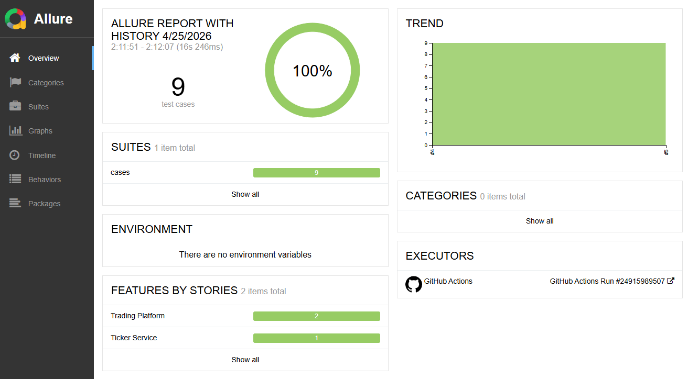
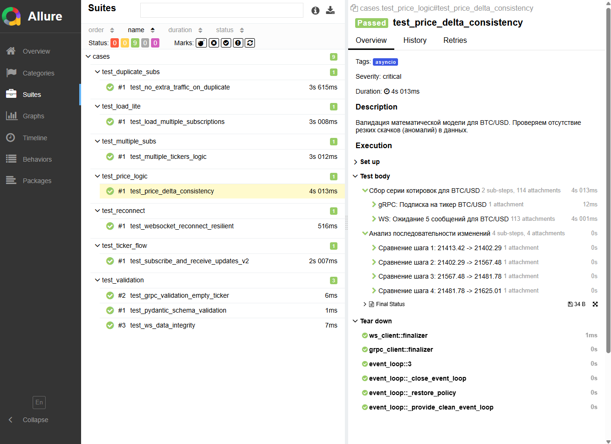

# gRPC & WebSocket Testing Lab


---

Профессиональный учебный проект AQA, демонстрирующий навыки автоматизации тестирования распределенных систем с использованием асинхронных протоколов **gRPC** и **WebSockets**.

## Описание решения
Проект имитирует микросервис «Биржевой монитор» (Ticker Service):
1. **Control Plane (gRPC):** Принимает команды на подписку/отписку от тикеров (например, `BTC/USD`).
2. **Data Plane (WebSocket):** Транслирует потоковые данные об изменении цен в реальном времени.

## Архитектура тестового фреймворка
Фреймворк построен с использованием многоуровневого подхода (Layered Architecture):

- **Clients Layer:** Асинхронные адаптеры для gRPC и WS, инкапсулирующие логику подключения и протоколов.
- **Service Layer (Helpers):** Высокоуровневая бизнес-логика тестов (например, "подписка + ожидание конкретного сообщения в стриме"). Реализована умная фильтрация сообщений для изоляции состояния тестов.
- **Data Layer (Pydantic):** Строгая валидация JSON-схем и бизнес-правил (например, проверка диапазонов цен и форматов тикеров).
- **Report Layer (Allure):** Интеграция с шагами (`steps`), вложениями (`attachments`) и метаданными (`epics`, `features`).

## Покрытые сценарии
Проект включает в себя 9 автоматизированных тестов, покрывающих ключевые аспекты надежности:
*    🔵 **E2E Flow:** Полный цикл от подписки до получения котировок.
*    🔵 **Contract Testing:** Валидация gRPC контрактов и ответов сервера.
*    🔵 **Resilience:** Проверка автоматического восстановления стриминга после разрыва соединения (Reconnect).
*    🔵 **Business Logic:** Проверка математической модели изменения цены (Delta check).
*    🔵 **Idempotency:** Тестирование защиты от дублирования трафика.
*    🔵 **Load Testing:** Массовая подписка на 20+ тикеров одновременно.
*    🔵 **Negative Testing:** Обработка пустых значений и некорректных форматов данных.

## Быстрый запуск (CI/CD Ready)
Проект полностью контейнеризирован. Для запуска всех тестов и сервера не требуется установка Python локально:

```bash
# Сборка и запуск тестов в изолированной сети Docker
docker-compose up --build --abort-on-container-exit
```

### Генерация отчета
После завершения тестов результаты доступны в папке `allure-results`:
```bash
allure serve allure-results
```

## Технологический стек
- **Backend:** Python 3.11, `grpcio`, `websockets`.
- **Testing:** `pytest`, `pytest-asyncio`, `allure-pytest`.
- **Validation:** `pydantic v2`.
- **Infrastructure:** `Docker`, `Docker Compose`, `GitHub Actions`.

## Скриншоты отчета Allure

---
### Dashboard

### Step Detail
  
